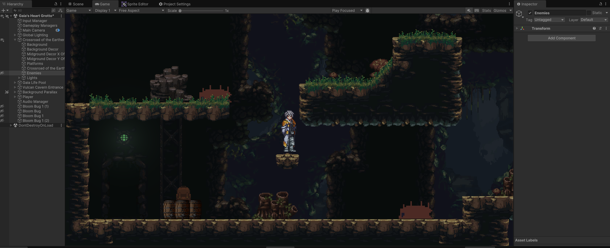

## Hi there, I am Jonathan Westfall. 👋
----
### :hammer_and_wrench: Languages and Tools:

 
 
 

 
 

 
 

## Current Project Video Link
> [!TIP]
> The image below is a clickable link to a YouTube video.

## Updates to community repos
The SF Platformer package is being updated in the Shatter Fantasy organization's SF-Metroidvania repo at the moment.
After the SF Metroidvania reaches the next major milestone the updates for the SF PLatformer will be merged into the SF Platformer repo as a standalone tool.

The SF Metroidvania package has a lot more than just the SF Platformer features. It has been heavily updated with the following:
1. New encryption supported save/load systems.
2. Metroidvania style room system that supports room spawn events for enemies, characters, and any other Unity gameobject.
3. RPG Stat System that is customizable.
4. Early WIP Inventory system.
5. A loot drop system for enemy drops and drops obtained when breaking containers. Think 2D Castlevania where certain objects could be broken to drop money, items, and other stuff.
6. A custom data editor for enemies, loot tables, item database, and a bit more. Please note this is the roughest wip area for the package. The Data Editor needs a lot more cleaning up UI wise.

There is a lot more medium and small features in it, but will mention them on the dedicated page for it located at the following link.

[SF Metroidvania Package](https://github.com/Shatter-Fantasy/SF-Metroidvania)

## Game Dev Blog
Please note the game dev blog will be updated in full after the first alpha release for Immortal Chronicles that is scheduled for June.
We are doing a live game dmeo at a convention May 31st and after that we can focus on some other stuff.

So the blog is nowhere near done, organizaed, and fully fnished on most topics even though we already have the information being prepared to be published.
The link here goes to a game dev blog where I have free community resources, tutorials, how to/tricks, and more stuff about things I make.
This has examples for C# coding, shaders, and VFX effects. It will include how to make the models and textures for the VFX and shaders as well.

[Game Developer Resource Blog](https://jonathans-private-organization.gitbook.io/jonathan-westfall-dev-blog)

## Self Learning Repos
Current self-learning repo is not public yet. Below is the prevous one. 
Currently making the standalone water tool for Unity in URP, so it can be dragged and dropped into any Unity 6 or newer version that is using URP.
Special thanks to Andre McGrail (Verasl) and Brendan Duncan for providing a great learning resource to start with for Gerstner Waves in Unity's Boat-Attack demo project.

There are several repos here, that are for self-learning and trying out new things. I will start marking the top of the read me section with a label saying self-learning repo that also says the current progress of it.
My current work in progress self-learning repo is a multithreading Unity project. It is a small real time strategy game meant to test out moving, selecting, and giving commands to game units using mutlithreading code. 

[Multithreading RTS Demo](https://github.com/crowhound/Multithreaded-RTS-DOTS-Demo)

## Unity Open Source Community Tools:
Currently I am working on a set of free packages to use with Unity to help make development easier for all members of the community. 
These are going to be open source for the community. Please note all the below tools is currently in pre-alpha, so not even alpha 1. 
We just finalized the roadmap for the first five alphas for all the packages and we finalized the documentation process on the week of November 10, 2024.
They will have documentation and an updated read me for easy install instructions via Unity's package manager added within the week of November 10, 2024.
All of them are currently usable even in pre-alpha state, but they should only be used in Unity 2023.2 or newer. 
This requirement is mostly due to not wanting to waste resources maintaining legacy UI Toolkit and Scriptable Render Pipeline code that was removed completely in Unity in 2023.2 and Unity 6.1.

### SF Platformer Unity community package
Development was shifted to the SF-Metroidvania package.
After the next major release the updates will be merged into the SF-Platformer package, but right now the SF-Metrdoivania package is where a lot of the development is.
It has a vast amount of improvements for physics, camera systems, and a lot more.

[Shatter Fantasy Platformer Package](https://github.com/crowhound/SF-Platformer)

### Other SF Unity community packages

[Shatter Fantasy GitHub Organization Page](https://github.com/Shatter-Fantasy)

[Shatter Fantasy UI Elements Tools](https://github.com/Shatter-Fantasy/SF-UI-Elements)

[Shatter Fantasy Utilities](https://github.com/Shatter-Fantasy/SF-Utilities)

> [!WARNING]
> The SF Sprite Tools package are currently in very experimental testing. 
> It is in early pre-alpha currently and can throw errors in rare cases.  
>Test the SF Sprite Tools in a new project. Do not use the pre-alpha package in a project that already exists till it is more stable.
>Read the install instructions carefully that are located in the read me at the following link.
>There is no documentation on it yet. To open the SF Sprite Editor look for the top menu bar menu for SF Tools.

[Shatter Fantasy Sprite Tools](https://github.com/crowhound/SF-Sprite-Tools)

### Other Recent Self-Learning 
Last self learning projects were aimed at combing the things I already knew about DocFX and GitHub Actions to auto generate C# and .net documentation for projects and tools API for users to read through.
DocFX is used to generate YAML, markdown, and HTML files from a set of C# and .net files. 
GitHub Actions is used to auomatically publish the documentation to a website for people to visit and learn from. 

Example link for the result of the very first test. Due note that I haven't set up the manual for the documentation to be generated yet and I need to add some descriptions to the properties.
Second link is to the GitHub Action code that I used to generate the documentation. I will make an example page on how to set up the config file soon for people wanting to generate documentation themselves.
This second link is part of the work in progres Shatter Fantasy UI Elements community tools. It is not even Alpha release 1 yet, but it is usable with a bit of UI Toolkit functionality.

[Shatter Fantasy UI Elements Community Tools API Documentation](https://shatter-fantasy.github.io/SF-UI-Elements/api/SFEditor.UIElements.Utilities.MouseRectDragManipulator.html)

[GitHub Action Code](https://github.com/Shatter-Fantasy/SF-UI-Elements/blob/master/.github/workflows/documentation.yml)

### Live Coding Self Learning Streams:
Every so often I do self-learning live streams or just testing out different ways to do stuff I already know how to do. 
These live streams will have me fumbling around as I try to learn new things or improve on stuff while streaming.
For anyone watching please keep in mind since I am doing self learning I might get stuck on certain areas for stuff I am learning from scratch.
These streams are meant to be a source of learning new developer techniques and to improve my skills.

[Ripple Shader Learning Clip](https://www.twitch.tv/videos/2300075570)

[Twitch Game Dev Channel](https://www.twitch.tv/8bitsperplay)

<!--
### Want To Support Future Community Tools.
For anyone wanting to support me, when I release the first set of public tools for the community you can donate on Ko-Fi.

-->
